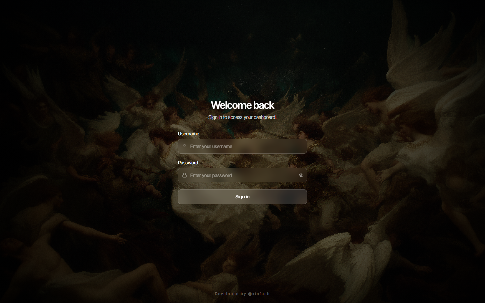
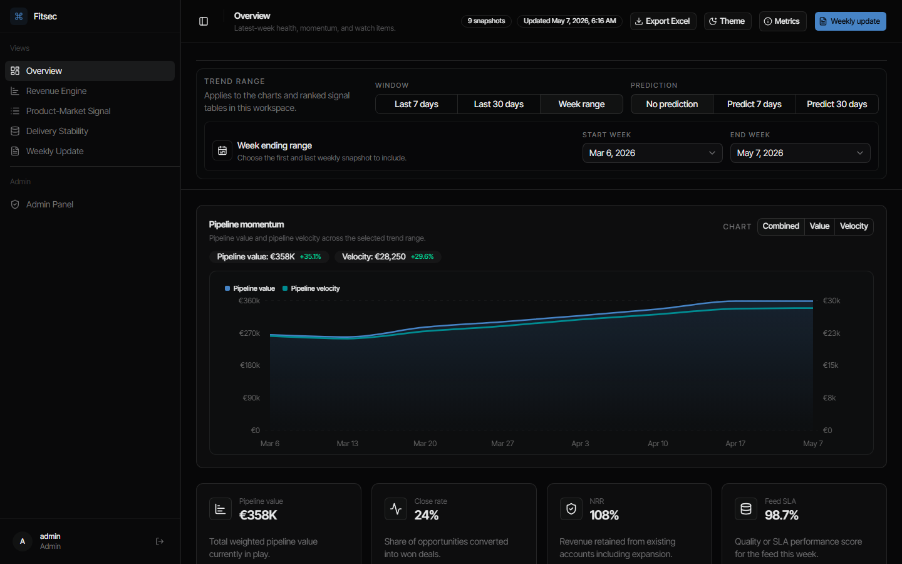

# RevOps Dashboard

Internal operating dashboard for weekly RevOps snapshots. App built with Next.js 16, React 19, shadcn/ui, Recharts, local auth, SQLite-backed snapshot history.

## Showcase

### Login



### Dashboard



## What it does

- Shows weekly revenue, product-market, and delivery health in one dashboard
- Stores weekly snapshots in SQLite with immutable revision history
- Auto-calculates `pipelineVelocity` from saved snapshot history instead of manual input
- Projects directional `+7d` and `+30d` estimates from saved weekly trends
- Exports saved timeline to Excel
- Includes admin-only user management, backend table viewer, and read-only SQL console

## Quick start

```bash
npm install
npm run build
npm start
```

Open [http://localhost:3000/login](http://localhost:3000/login).

Default local accounts are seeded on first run:

- Admin: `admin` / `admin123`
- User: `user` / `user123`

When signed in as admin, left sidebar shows `Admin Panel` inside dashboard workspace. Admins can manage users, inspect real backend tables, review saved revisions, and run guarded read-only SQL queries from frontend.

## Commands

```bash
npm run dev      # development server
npm run build    # production build
npm start        # start production server
npm run lint
npm run test
```

## Data storage

- Primary storage: `data/revops-dashboard.db`
- Local user store: `data/users.json`
- Legacy seed source: `data/weekly-metrics.json`
- Real app tables: `workspaces`, `snapshots`, `snapshot_revisions`
- Saving same `weekOf` again creates new revision and updates latest visible version for that week
- Each revision stores who saved it in `author_label`
- Passwords in local user store are hashed with bcrypt

Useful environment overrides:

```bash
REVOPS_DASHBOARD_DB_PATH=/custom/path/revops-dashboard.db
REVOPS_LEGACY_SNAPSHOT_PATH=/custom/path/weekly-metrics.json
```

## Important routes

- `/login` - sign-in page
- `/dashboard` - main dashboard
- `/admin` - direct admin panel route, also available as in-dashboard sidebar view for admin users
- `/api/weekly-snapshots` - timeline GET and snapshot POST
- `/api/weekly-snapshots/[weekOf]/revisions` - revision history for reporting week
- `/api/export/weekly-snapshots` - Excel export

## Project docs

- [Developer Guide](docs/developer-guide.md)
- [User Guide](docs/user-guide.md)

## Key implementation files

- `components/dashboard-workspace.tsx` - main dashboard surface
- `components/app-sidebar.tsx` - dashboard sidebar and admin-only view entry
- `app/admin/admin-panel.tsx` - admin user management UI, backend viewer, read-only SQL console
- `app/admin/actions.ts` - admin-only server actions for account management and guarded SQL access
- `components/weekly-update-form.tsx` - weekly snapshot form
- `lib/auth.ts` - cookie-backed session lookup
- `lib/user-store.ts` - local JSON user store and bcrypt password helpers
- `lib/dashboard-navigation.ts` - shared dashboard/admin workspace view metadata
- `lib/admin-debug.ts` - admin backend inspection helpers
- `lib/kpi-dashboard.ts` - schemas, metric definitions, formatting, derived velocity logic
- `lib/dashboard-forecast.ts` - 7 day and 30 day projection logic
- `lib/dashboard-db.ts` - SQLite schema, migration, revision persistence
- `lib/dashboard-store.ts` - server-side data access

## Notes for maintainers

- This repo uses newer Next.js version than many older examples online. Read local docs in `node_modules/next/dist/docs/` before framework-level changes.
- Keep UI changes conservative unless explicitly requested. Most product work should land in data flow, reporting logic, and maintainability first.
- Forecast is directional, not committed target. Treat it as operating signal.
